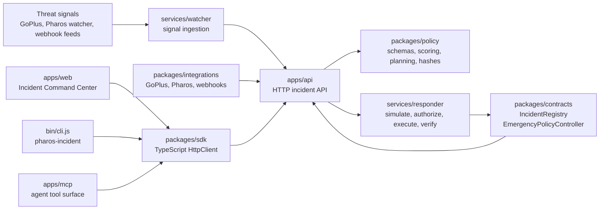
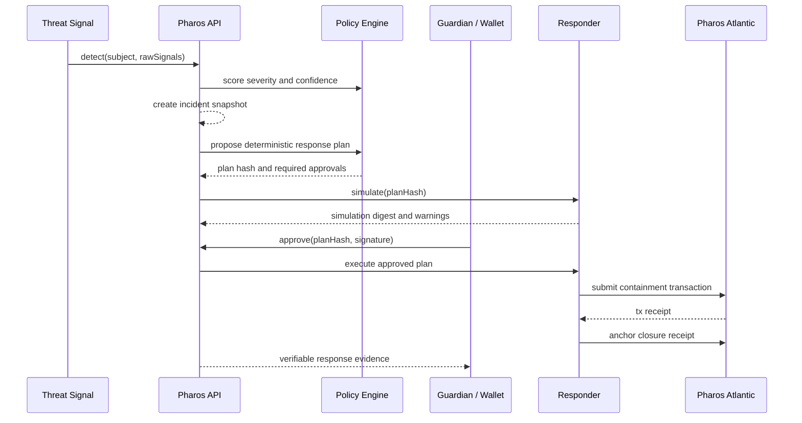

# Pharos Agent Incident Response

Pharos Agent Incident Response is an end-to-end security response system for
autonomous on-chain agents. It detects suspicious agent or wallet activity,
turns raw signals into structured incidents, proposes policy-controlled
containment actions, collects approvals, executes safe responses, and records
verifiable incident receipts on Pharos Atlantic.

The project is built as a production-oriented monorepo with a web command
center, HTTP API, TypeScript SDK, CLI, MCP tool surface, responder and watcher
services, policy engine, integrations, and Solidity contracts.

## Why This Exists

Autonomous agents can approve spenders, rotate keys, execute transactions, and
move value faster than a human security team can manually react. When a session
key leaks or an agent signs a dangerous approval, teams need a response loop
that is fast, controlled, non-custodial, and auditable.

Pharos provides that loop:

- Detect risky behavior from watchers, threat feeds, and webhooks.
- Triage severity and confidence using deterministic policy logic.
- Propose containment plans such as revoking approvals, pausing agents, or
  rotating key metadata.
- Simulate every response before it can execute.
- Require explicit guardian or policy approval for write actions.
- Execute on Pharos Atlantic without taking custody of user funds.
- Anchor receipts so incidents can be reviewed and independently verified.

## Current Status

Implemented and deployed to Pharos Atlantic testnet.

- Web command center supports demo mode and live API mode.
- API, SDK, CLI, MCP, watcher, responder, policy, integrations, and contracts
  are implemented.
- Test suites pass across JavaScript, TypeScript, and Foundry workspaces.
- Pharos Atlantic acceptance scenarios S1-S5 passed on chain ID `688689`.
- Public npm package metadata is prepared for CLI, SDK, MCP, and policy
  packages.

Deployment evidence:

- Acceptance report: `docs/atlantic-acceptance-results.md`
- Public manifest: `deployments/atlantic.public.json`
- Full acceptance receipts: `deployments/atlantic.acceptance.json`

## Architecture



## Incident Response Flow



## Monorepo Structure

```text
.
|-- apps
|   |-- api              # Fastify HTTP API for incident lifecycle operations
|   |-- mcp              # MCP tools for AI agents and automation clients
|   `-- web              # React/Vite command center and guided demo UI
|-- bin
|   `-- cli.js           # pharos-incident CLI entrypoint
|-- deployments          # Public Pharos Atlantic manifests and receipts
|-- docs                 # Runbooks, threat model, verification, reports
|-- infra
|   `-- alibaba          # Serverless deployment definitions
|-- packages
|   |-- contracts        # Solidity IncidentRegistry and policy controller
|   |-- integrations     # GoPlus, Pharos, and webhook clients
|   |-- policy           # Types, Zod schemas, scoring, planning, hashes
|   `-- sdk              # Typed TypeScript API client and Atlantic helpers
|-- scripts              # Deployment, acceptance, build, and security scripts
`-- services
    |-- responder        # Simulation, authorization, execution, verification
    `-- watcher          # Signal collection and checkpointing
```

Local render outputs, generated videos, superpower planning notes, logs,
screenshots, build output, and environment files are intentionally ignored and
kept out of the public repository.

## Packages

| Package | Purpose |
| --- | --- |
| `pharos-agent-incident-response` | CLI package exposing `pharos-incident` |
| `@pharos-incident/sdk` | Typed TypeScript client for the HTTP API |
| `@pharos-incident/mcp` | MCP tool surface for agent workflows |
| `@pharos-incident/policy` | Shared policy schemas, scoring, planning, hashes |

The packages are configured for public npm publishing with `publishConfig:
{ "access": "public" }`. Publish order is:

```text
@pharos-incident/policy
@pharos-incident/sdk
@pharos-incident/mcp
pharos-agent-incident-response
```

## Quick Start From Source

Requirements:

- Node.js 20 or newer
- npm
- Foundry, only for Solidity contract tests and deployment

Install, build, and test:

```bash
npm install
npm run build
npm run typecheck
npm test
```

Run the web command center:

```bash
cd apps/web
npx vite
```

Run the API:

```bash
cd apps/api
set PHAROS_INCIDENT_API=1
set PORT=8799
npm start
```

PowerShell equivalent:

```powershell
cd apps/api
$env:PHAROS_INCIDENT_API = "1"
$env:PORT = "8799"
npm start
```

By default, the web app can fall back to seeded demo mode when no API is
available. Live Testnet Mode uses the configured API and an injected wallet on
Pharos Atlantic.

## CLI

The CLI mirrors the main incident lifecycle API.

```bash
pharos-incident <command> [options]
```

Commands:

```text
detect   --subject <address> --signals <json>
triage   --id <incident-id>
propose  --id <incident-id>
simulate --plan <plan-hash>
approve  --plan <plan-hash> --approver <address> --signature <hex>
execute  --plan <plan-hash> --approver <address> --signature <hex>
verify   --plan <plan-hash>
close    --plan <plan-hash>
```

Configure the API base URL:

```bash
export PHAROS_INCIDENT_API_URL=https://your-api.example.com
```

PowerShell:

```powershell
$env:PHAROS_INCIDENT_API_URL = "https://your-api.example.com"
```

Example read-only commands:

```bash
pharos-incident triage --id 0x...
pharos-incident simulate --plan 0x...
pharos-incident verify --plan 0x...
```

Example detection command:

```bash
pharos-incident detect \
  --subject 0x0000000000000000000000000000000000000001 \
  --signals '[{"source":"goplus","type":"MALICIOUS_APPROVAL","severity":90,"evidenceHash":"0x0000000000000000000000000000000000000000000000000000000000000000","confidenceBps":9500,"observedAt":1730000000}]'
```

Write operations are guarded. `approve`, `execute`, and `close` require:

```bash
export PHAROS_INCIDENT_CONFIRM=1
```

PowerShell:

```powershell
$env:PHAROS_INCIDENT_CONFIRM = "1"
```

## SDK

The SDK provides a typed `HttpClient` for application code, bots, serverless
jobs, and integration tests.

```ts
import { HttpClient } from "@pharos-incident/sdk";

const client = new HttpClient("https://your-api.example.com");

const incident = await client.detect({
  subject: "0x0000000000000000000000000000000000000001",
  rawSignals: [
    {
      source: "goplus",
      type: "MALICIOUS_APPROVAL",
      severity: 90,
      evidenceHash:
        "0x0000000000000000000000000000000000000000000000000000000000000000",
      confidenceBps: 9500,
      observedAt: Date.now(),
    },
  ],
});

const triage = await client.triage(incident.id);
const plan = await client.propose(incident.id);
const simulation = await client.simulate(plan.planHash);
```

Main SDK methods:

```text
detect(input)
triage(incidentId)
propose(incidentId)
simulate(planHash)
approve(input)
approvalNonce(planHash, approver)
submitApprovalIntent(intentId, intent, signature)
confirmApproval(intentId, txHash)
execute(input)
transaction(txHash)
verify(planHash)
close(planHash)
```

The SDK also exports Pharos Atlantic constants and ABI helpers from
`@pharos-incident/sdk`.

## MCP

`@pharos-incident/mcp` exposes the incident lifecycle as tools that can be used
by AI agents and automation runtimes.

Available tools:

| Tool | Description | Write guarded |
| --- | --- | --- |
| `incident_detect` | Run detection on a wallet or agent subject | No |
| `incident_triage` | Read severity and score for an incident | No |
| `incident_propose` | Build a deterministic response plan | No |
| `incident_simulate` | Simulate plan actions | No |
| `incident_verify` | Read closure receipt and verification status | No |
| `incident_approve` | Submit an approval | Yes, requires `confirm: true` |
| `incident_execute` | Execute an approved plan | Yes, requires `confirm: true` |
| `incident_close` | Close a verified plan | Yes, requires `confirm: true` |

Programmatic usage:

```ts
import { HttpClient } from "@pharos-incident/sdk";
import { buildTools } from "@pharos-incident/mcp";

const client = new HttpClient("https://your-api.example.com");
const tools = buildTools(client);

const triageTool = tools.find((tool) => tool.name === "incident_triage");
const result = await triageTool?.run({ id: "0x..." });
```

The MCP package intentionally keeps write tools explicit. An agent cannot call
`incident_approve`, `incident_execute`, or `incident_close` unless it passes
`confirm: true`.

## API Surface

The HTTP API supports the same lifecycle used by the CLI, SDK, MCP tools, and
web app.

```text
POST /detect
GET  /triage/:incidentId
POST /propose
POST /simulate
POST /approve
POST /approvals/nonce
POST /approve/confirm
POST /execute
GET  /transactions/:txHash
GET  /verify/:planHash
POST /close
```

## Web Command Center

`apps/web` is a React/Vite interface for security operators.

It includes:

- Homepage explaining the incident response value proposition.
- Guided demo with malicious approval, suspicious transaction burst, and leaked
  session key scenarios.
- Demo Mode for safe in-memory workflows.
- Live Testnet Mode for API and wallet-backed Pharos Atlantic workflows.
- Incident list and incident detail views.
- Wallet connection, network readiness checks, and evidence panels.

## Contracts And Pharos Atlantic

Network: `pharos-atlantic`

| Contract | Address |
| --- | --- |
| IncidentRegistry | `0x0d93b5cD4356652ef6b4776949A86979e9c00cdE` |
| EmergencyPolicyController | `0xA2F7fEED38f72eF63ACa52696C1620a3e2EecE2d` |
| AgentRegistry | `0x2d1B360dec14e63846735939E793bcb1655Aa93b` |

Explorer:

```text
https://atlantic.pharosscan.xyz
```

Run contract tests:

```bash
npm run contracts:test
```

Deploy and run acceptance against configured Pharos Atlantic credentials:

```bash
cp .env.example .env
npm run deploy:atlantic
npm run acceptance:atlantic
```

On Windows, make sure `forge.exe` is on `PATH` or installed under one of the
paths checked by `scripts/run-forge.mjs`:

```text
%USERPROFILE%\.foundry\bin
%USERPROFILE%\foundry
C:\foundry
```

## Security Model

- Read actions are allowed by default.
- Write actions require explicit confirmation in CLI and MCP.
- Live web approvals use an injected wallet on Pharos Atlantic.
- Plan hashes and closure hashes are deterministic.
- Response plans are simulated before execution.
- Deployment manifests are sanitized before public use.
- `.env`, private deployment files, local render output, logs, screenshots, and
  generated build artifacts are ignored by git.

Run the local secret scan:

```bash
npm run secret-scan
```

## Documentation

- Implementation guide: `docs/README-implementation.md`
- Threat model: `docs/threat-model.md`
- Policy model: `docs/policy.md`
- Isolation model: `docs/isolation.md`
- Atlantic runbook: `docs/atlantic-runbook.md`
- Acceptance results: `docs/atlantic-acceptance-results.md`
- Final verification: `docs/final-verification-report.md`
- Web demo report: `docs/web-demo-report.md`
- Runbooks: `docs/runbooks/`

## License

MIT
